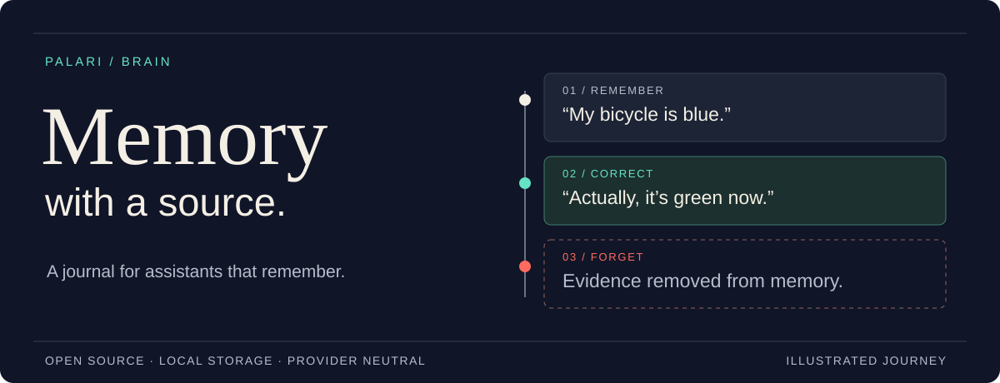

<p align="center">
  
</p>

<h1 align="center">Palari Brain</h1>

<p align="center">
  Long-term memory for assistants, grounded in the conversation that created it.
</p>

<p align="center">
  <a href="docs/SIMPLIFICATION.md"></a>
  
  <a href="LICENSE"></a>
</p>

<p align="center">
  <a href="#try-it-locally">Try it</a> ·
  <a href="#use-the-core">Use the core</a> ·
  <a href="docs/SIMPLIFICATION.md">Integration guide</a> ·
  <a href="docs/README.md">Documentation</a> ·
  <a href="https://github.com/CoyStan/palari-brain/issues">Issues</a>
</p>

An assistant remembers that your bicycle is blue. Later, you correct it to green.
Then you ask it to forget. The next answer should reflect each change, and you
should be able to inspect the source behind it.

Palari stores exact dialogue with its speaker, time, and private scope. Retrieval
returns to those records. Corrections preserve what was said and when; forgetting
removes the selected records and invalidates their dependent memory state.
You choose the model, the retrieval strategy, and whether to use a summary.

> **An index may locate evidence. It may never become evidence.**

## Try it locally

Requires **Node.js 22.5+**. This example uses a temporary local store and scripted
answers. No API key, model download, or paid provider is needed.

```bash
git clone https://github.com/CoyStan/palari-brain.git
cd palari-brain
npm install --omit=optional
npm run quickstart:simple
```

```text
Remember: My bicycle is blue.
Correct: Correction: my bicycle is green.
Read: original and correction remain separately attributable.
Forget: no evidence returned; no answer provider called.
```

Read the [complete example](examples/quickstart-simple.mjs), or run
`npm run quickstart` to see the same memory journey with incremental reduction.
The optional native dependency accelerates eligible semantic searches; the
journal example works without it.

## What makes Palari different

| Behavior | How it works |
| :--- | :--- |
| Trace a memory to its source | Store exact visible dialogue with host-assigned speaker, timestamp, and identity. |
| Keep each user's memory separate | Apply the caller's scope to storage, search, and canonical reads within a workspace store. |
| Handle a correction without erasing history | Admit the new statement as new evidence. A configured reducer can supersede the earlier derived item. |
| Forget specific evidence | Delete by owned record ID and invalidate dependent derived state. |
| Check an answer's citations | The retrieval answer paths validate that cited IDs and contiguous quotes belong to evidence returned in that answer session. |

A valid citation proves where the text came from. It does **not** prove that the
model interpreted it correctly. Palari keeps that distinction explicit.

## Use the core

The code below runs from a checkout as `node --input-type=module`. It stores,
finds, reads, and deletes a memory without calling a model.

```js
import { randomUUID } from 'node:crypto'
import {
  createPalariBrain,
  forgetMemories,
  ingestChatTurn,
} from './src/core.mjs'

const brain = await createPalariBrain({
  memoryEnabled: true,
  memoryRootDir: './.palari-alpha/readme-demo',
  workspaceId: 'my-app',
  digestMode: 'off',
})
const scope = { palariId: 'assistant', userId: 'alice' }

try {
  const stored = await ingestChatTurn(brain, {
    ...scope,
    retention: 'durable',
    sourceMessageId: randomUUID(), // One new interaction per demo run.
    eventAt: '2026-09-06T09:00:00Z',
    userMessage: 'My bicycle is blue.',
    assistantMessage: '',
  })

  const found = brain.exploreFind(scope, {
    phrase: 'bicycle',
    ranked: true,
  })
  const evidence = brain.exploreRead(scope, {
    evidenceIds: found.matches.map(row => row.evidenceId),
  })
  console.log(evidence.messages.map(row => row.text))
  // ['My bicycle is blue.']

  forgetMemories(brain, stored.written.map(row => row.id), scope)
} finally {
  brain.close()
}
```

Your application supplies authenticated scope and decides what to retain.
To record a correction, ingest the user's new corrective statement with a new
message ID. In journal mode, the answer policy interprets the chronology.

When installed as a package from this revision, import from `palari-brain/core`
and `palari-brain/answers`. This README describes **`main`**. The older
[`v0.1.0-alpha.1` release](https://github.com/CoyStan/palari-brain/releases/tag/v0.1.0-alpha.1)
predates these entrypoints. The package is not published to the npm registry.

## Choose how much memory machinery you need

```text
Host-approved dialogue
         │
         ▼
 Canonical journal ────────────── exact scoped reads
         │                              ▲
         ├── optional digest            │
         └── retrieval indexes ─────────┘
                                        │
                                        ▼
                              answer + checked citations
```

Start with the journal. Add derived components when your application needs them.

| Choice | What it adds |
| :--- | :--- |
| `digestMode: 'off'` | Journal storage and recall without reducer calls. |
| Optional reducer | Compact derived context, with revisions and freshness checks. |
| `answerWithSingleSearch` | One scoped hybrid search, canonical readback, and at most one answer callback. Defaults to lexical plus optional exact semantic retrieval. |
| `answerWithRetrieval` | Bounded retrieval tools with optional planning, multi-hop exploration, composition, and confirmation policies. |
| Embeddings, chunks, graph, rerankers, HNSW | Configurable ways to locate or rank evidence. Canonical dialogue remains the source. |

The [integration guide](docs/SIMPLIFICATION.md) covers the callback contract,
limits, and configuration. Existing root exports remain supported.

## What is proven so far

Palari is an **alpha library** with local SQLite storage and injected providers.
It is not a hosted memory service. The core does not call a model on its own.

The offline examples and contract tests exercise admission, attribution, scope,
retrieval, correction, deletion, and citation validation. The scripted comparison
covers 12 combinations of journal/digest modes, answer paths, and memory events.
It checks integration behavior, not model reasoning quality.

Real-model comparisons on previously unused histories remain open. We have not
established an advantage over long context or a simpler profile-plus-search
system, and existing diagnostics do not establish 100M-token capacity. Scoped
BM25 has a per-query indexing cost; maximum-chunk retrieval remains experimental.
See [current status](STATUS.md) and [evaluation notes](evals/README.md).

<details>
<summary><strong>Run the checks</strong></summary>

```bash
npm test                      # Focused, provider-free contracts
npm run test:legacy           # Broader compatibility suite
npm run quickstart           # Incremental digest journey
npm run quickstart:simple    # Journal-only journey
npm run alpha:compare-simple # Scripted comparison, no provider calls
npm run package:check        # Offline install and public entrypoints
```

Provider-backed diagnostics require an explicit aggregate dollar cap. See the
[evaluation guide](evals/README.md) before running them. Keep private data and
credentials out of commits and issue reports.

</details>

## Find your next step

| I want to… | Start here |
| :--- | :--- |
| Integrate Palari into an app | [Smaller integration guide](docs/SIMPLIFICATION.md) |
| Understand storage and evidence rules | [API contract](docs/BRAIN-API.md) |
| Wire identity, scope, and providers | [Consumer guide](docs/CONSUMER-SEAM.md) |
| Explore the implementation | [Storage kernel](src/memory-kernel.mjs) · [Answer strategies](src/answer-strategies.mjs) |
| Reproduce a failure or compare approaches | [Evaluations](evals/README.md) |
| See what changed | [Changelog](CHANGELOG.md) |

## Help build it

Useful contributions start with a concrete memory journey: what was stored,
what was asked later, and what should happen after a correction or deletion.
[Open an issue](https://github.com/CoyStan/palari-brain/issues) with a minimal,
synthetic example, or send a focused pull request. Include the expected behavior
and the checks you ran. Never include someone's private conversation.

Read the [agent charter](AGENTS.md) for the repository's development boundaries.

---

[MIT licensed](LICENSE). [Original Palari artwork](assets/brand/README.md) ships
under the same license.
